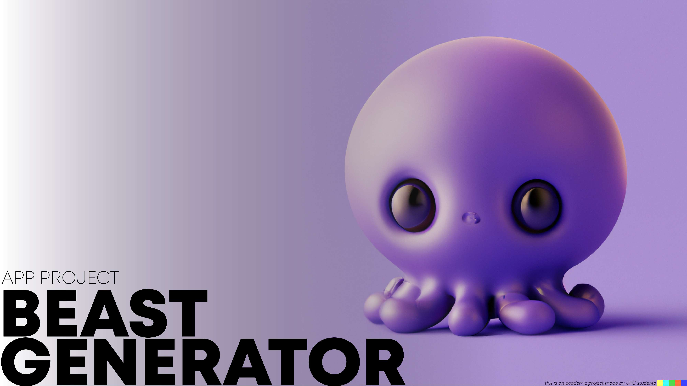
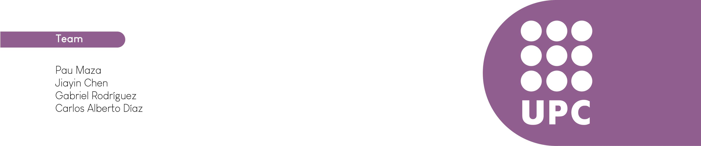
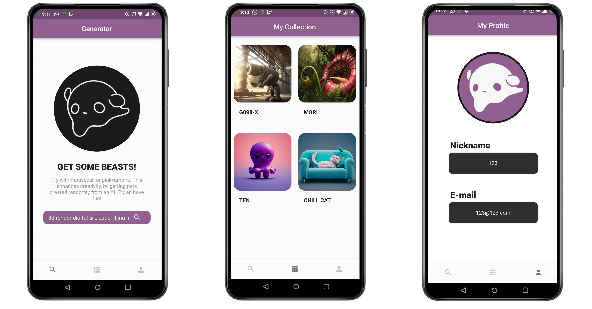

<h1>Project about Generating Beast Images with OpenAI DALL·E</h1>

This project was carried out in collaboration for a subject on mobile application development in Flutter (2022).
The OpenAI beta API (DALL·E) was used to generate images.
The app is an interface to order images and save them to a Firebase database.

<h2>Beast Generator App</h2>

<h2>Collaborators for the project</h2>

<h2>Screens of App</h2>

